# 자바의 정석3 객체지향 파트 연습문제 풀이

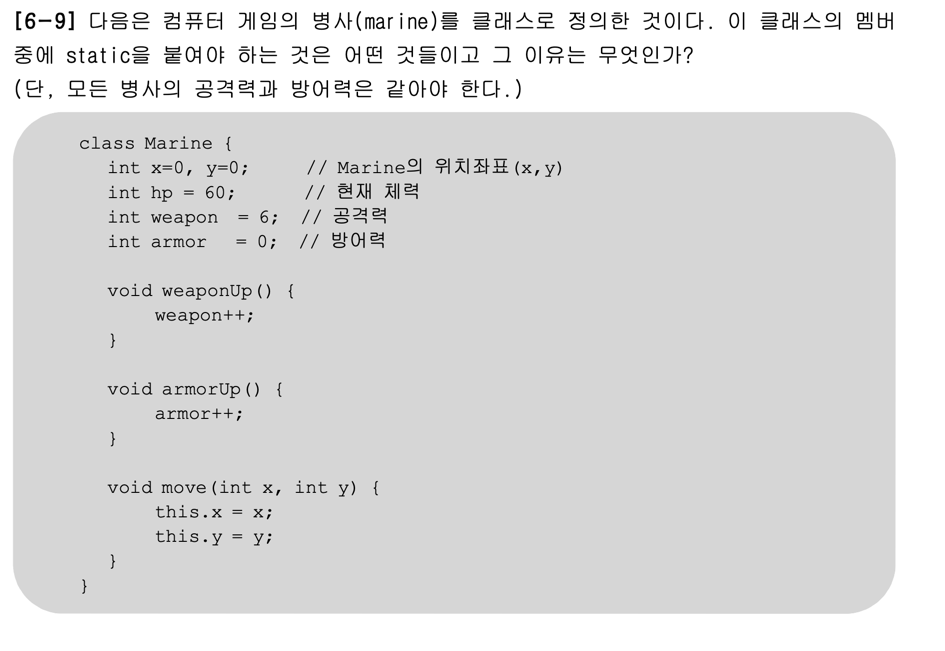
### 답
- 변수 : int weapon / int armor -> static 붙여준다.
- 메서드 : void weapon() / void armorUp() -> static 붙여준다
- 이유 : 보든 병사의 공격력과 방어력은 같아야 하기 때문에.
---
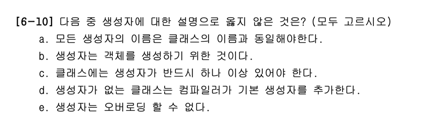
### 답 : b, e 
- b : 객체를 생성하기 위함이 아니라 초기화를 하기 위함이다.
  - 객체의 생성은 new연산자이다.
- e : 생성자도 오버로딩이 가능해서 하나의 클래스에 여러 개의 생성자 정의 가능
---
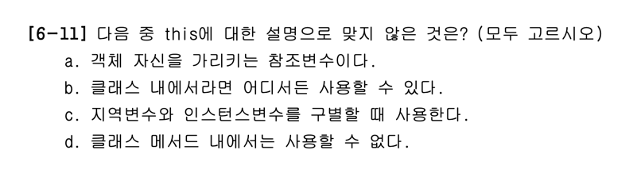
### 답 : b
- b : 클래스멤버에(static이 붙은 변수나 메서드)있으면 사용 불가.
  -  this는 인스턴스 자기 자신의 주소를 저장하고 있다.모든 인스턴스 메서드에 숨겨진채 존재하는 지역변수이다. 그래서 인스턴스 메서드 내에서만 존재 가능하다. 
---
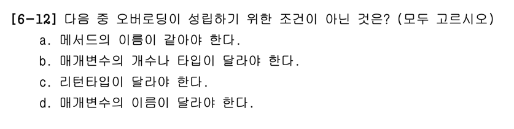
### 답 : c, d
- c : 리턴 타입은 오버로딩에 영향을 주지 않는다.
- d : 매개변수의 이름은 같아도 되고,매개변수의 타입 혹은 갯수가 달라야 오버로딩이 성립!
---
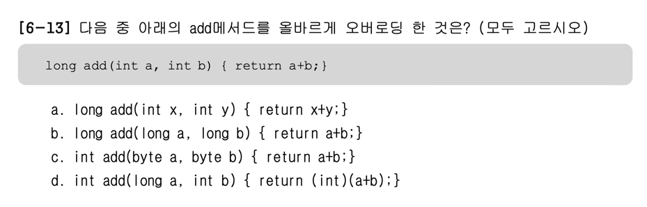
### 답 : b, c, d
- b,c,d : 오버로딩의 조건인 **메서드이름 같음+매개변수의 타입이 다름**
---
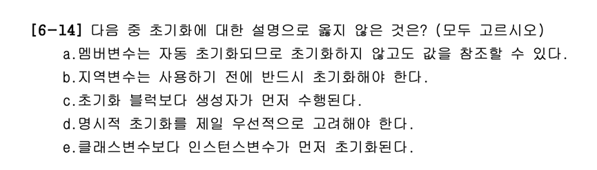
### 답 : c, e
- c : 초기화 블럭이 먼저 수행 된다
- e : 클래스 변수 먼저 초기화 되고 인스턴스 가 초기화 됨.
  - 왜? 클래스 변수는 클래스가 처음 메모리에 띄워질때 자동 초기화 되므로!
---
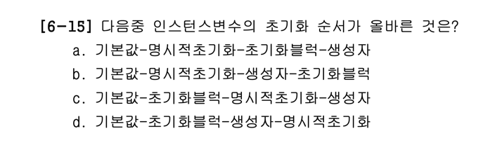
### 답 : a

---
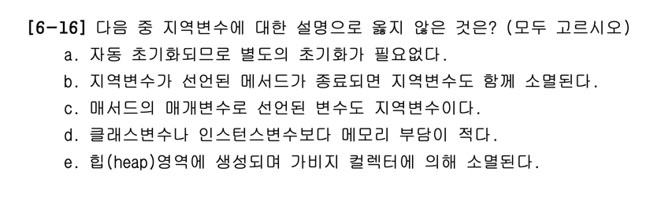
### 답 : a, e
- a : 자동 초기화 되지 않으므로 꼭 수동 초기화 해주어야 한다!
- e : Heap 영역에는 인스턴스 변수가 생성되는 영역이며, 지역 변수는 호출스택(call stack)에 생성됨
---
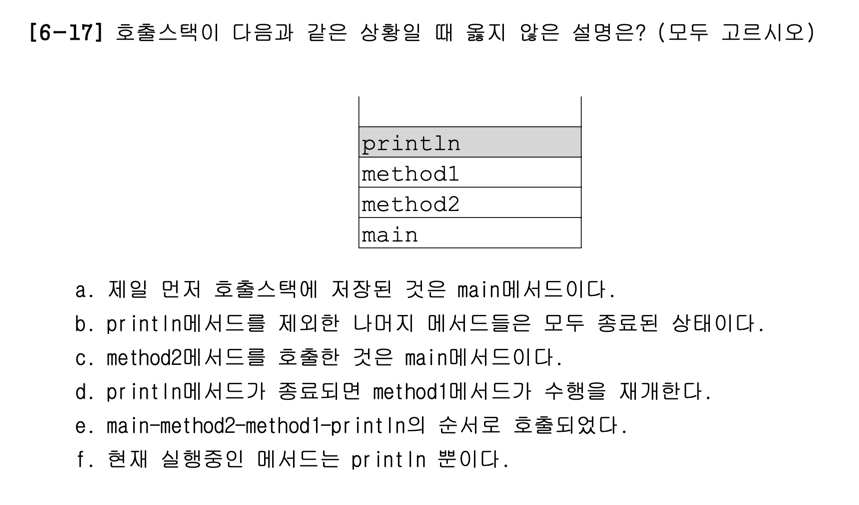
### 답 : b
- b : 호출 스택속 나머지 메서드들은 종료된 상태가 아니라 대기중인 상태이다
---
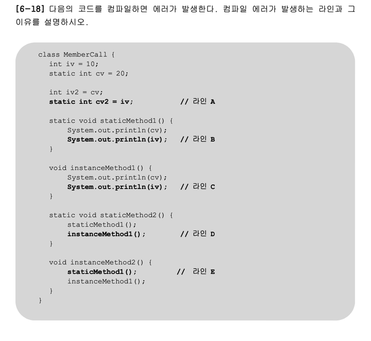
### 답 : a, b, d
- a : static 변수의 초기화에 인스턴스 변수를 사용할 수 없다
  - 꼭 사용하고 싶다면 객체를 생성해야 한다.
- b : static 메서드에서는 인스턴스 변수를 사용할 수 없다.
- d : static 메서드에서는 인스턴스 메서드도 사용할 수 없다.
---
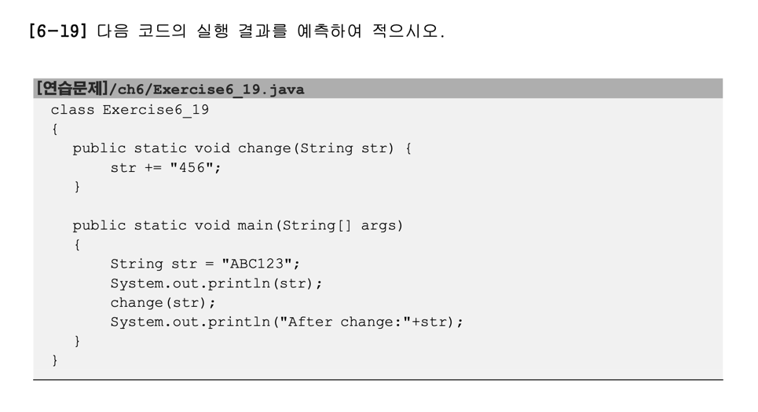
### 답 : ABC123 / AFter change : ABC123

---

### 답 : 오버라이딩이란 조상 클래스로부터 상속받은 메서드를 자손클래스에 맞게 재정의 하는것을 말한다. 조상 클래스로부터 상속받은 메서드를 자손 클래스에서 그대로 사용할 수 없는 경우가 많기 때문에 오버라이딩이 필요하다.

---
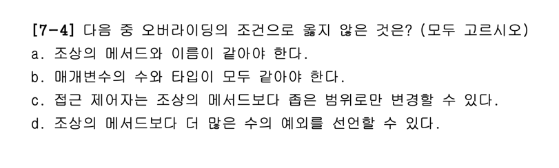
### 답 : c, d
- c : 접근 제어자는 조상의 메서드보다 좁은 범위로 변경할 수 없다
- d : 조상의 메서드보다 더 많은 수의 예외를 선언할 수 없다.
---
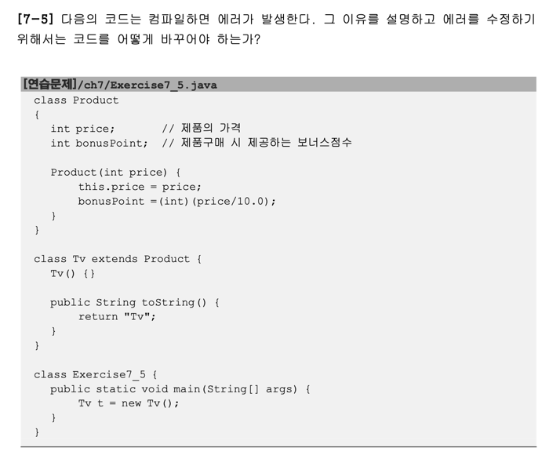
### 답 : Product클래스에 기본 생성자 Product(){} 초기화를 해주어야 한다.

---
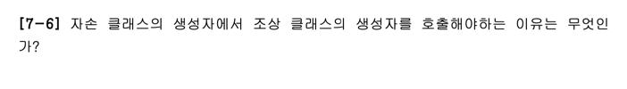
### 답 : 조상에 정의된 인스턴스 변수들이 초기화 되도록하기 위해서

---
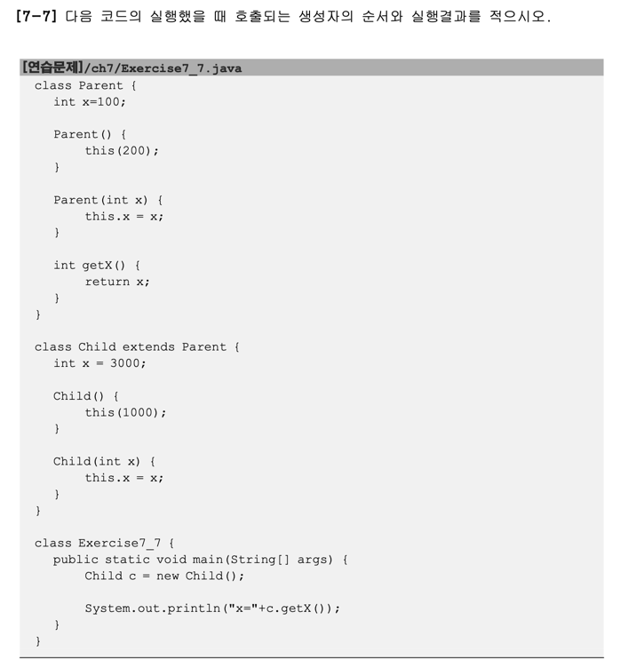
### 답 : Child() -> Child(int x) -> Parent()->Parent(int x)->Object()

---
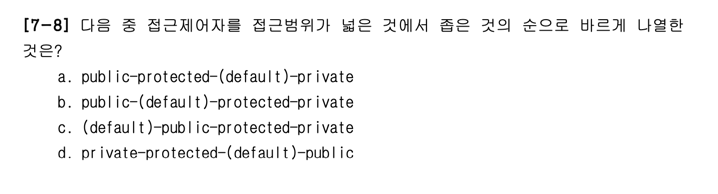
### 답 : a
- public : 같은 클래스 내에서만 접근 가능
- default : 같은 패키지 내에서만 접근 가능
- protected : 같은 패키지 내에서, 그리고 다른 패키지의 자손클래스에서 접근이 가능하다
- private : 접근 제한이 전혀 없다
---
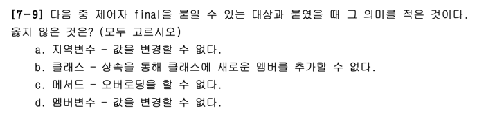
### 답 : c
- c : 오버로딩이 아니라 오버라이딩이다
---
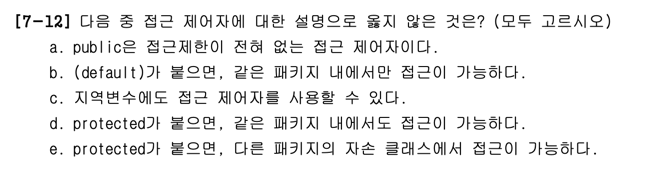
### 답 : c
- c : 접근제어자가 사용될 수 있는 곳 - 클래스,멤버변수,메서드,생성자 
---
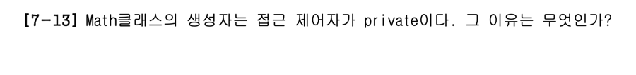
### 답 : Math 클래스의 모든 메서드가 static 메서드이고 인스턴스 변수가 존재하지 않기 때문에 객체를 생성할 필요가 없다

---
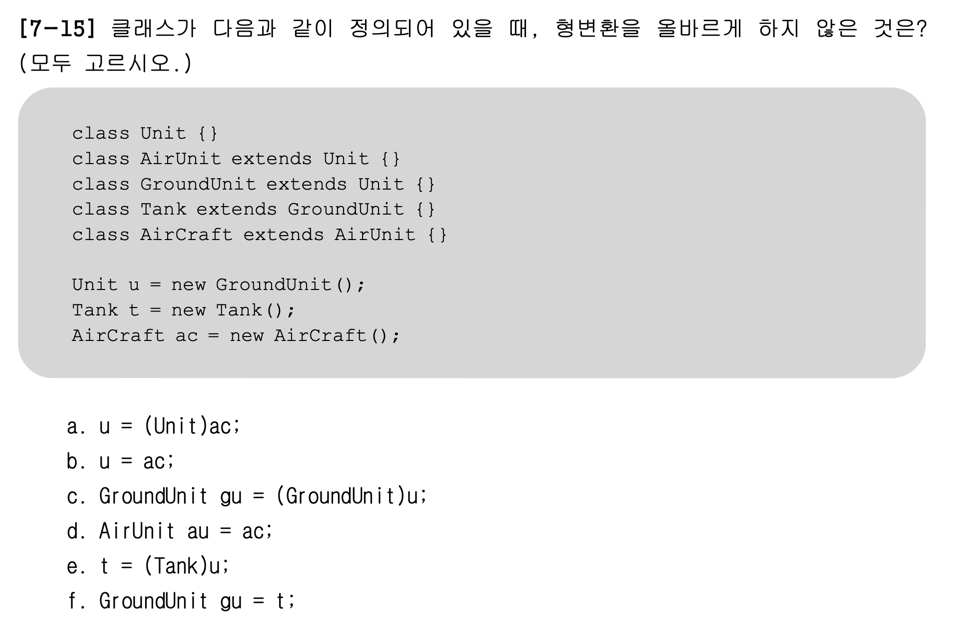
### 답 : 조상타입의 인스턴스를 자손타입으로 형변환 할 수 없다

---
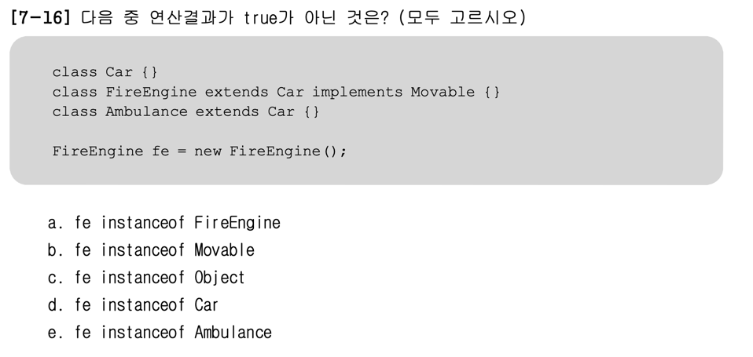
### 답 : e
- e : 조상-자손 관계의 참조변수는 서로 형변환 가능 but Ambulance와 FireEngine은 조상-자손의 관계가 아니다 

